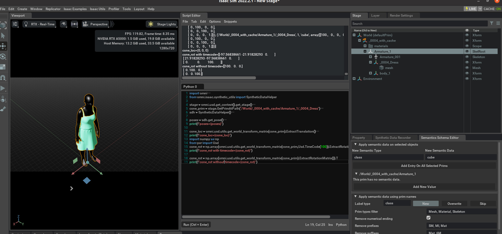

## Tips and tricks

### Main concepts

The simulation has various components.
1. `kit` or `SimulationApp` used to access the engine itself. Essentially, the base engine over which everything works [link](https://docs.omniverse.nvidia.com/py/isaacsim/source/extensions/omni.isaac.kit/docs/index.html). You can't do much with this. It's always the first call, prior to loading isaac/omni components (even python import calls).
2. The simulation context. This class provide functions that take care of many time-related events such as perform a physics or a render step for instance. It also includes an instance of PhysicsContext which takes care of many physics related settings such as setting physics dt, solver type..etc [link](https://docs.omniverse.nvidia.com/py/isaacsim/source/extensions/omni.isaac.core/docs/index.html?highlight=context#module-omni.isaac.core.simulation_context).
3. The `stage` object. Accessed with `omni.usd.get_context().get_stage()`. Used to access all the simulations objects and their properties, e.g. through `prim = stage.GetPrimAtPath('/whatever')`. 
4. `omni` is generally available, independently in which piece of code you are. Thus using 3. or `omni.kit.app.get_app()` you should be able to access everything you need without passing objects around.

You'll work mainly with 2 and 3. All functions have autocomplete capabilities, just place a breakpoint and walk your way through them. 

If you hover over some properties in the UI sometimes a helper dialog will give you the name of the property. Otherwise, the `prim.GetPropertyNames()` will give you the available properties. 

In general, the prims and their properties are accessed through a prim tree. Sometimes, some properties, are accessible only if the prim is accessed as a specific kind (e.g. a mesh [link](https://github.com/eliabntt/GRADE-RR/blob/7d9cb9a3d75d57628adacb9b9f969909d7663f3d/simulator/smpl_and_bbox.py#L206)) or under specific additional keywords (e.g. the physics collision [link](https://github.com/eliabntt/GRADE-RR/blob/7d9cb9a3d75d57628adacb9b9f969909d7663f3d/simulator/utils/misc_utils.py#L275)). Unfortunately, there is no easy way to figure this out due to the symbiosys between Isaac and USD.

NOTE that some functions are highly customized (e.g. `set_drone_joints_init_loc`)! This is thought to help you out set up your _custom_ simulation, and not an off the shelf solution!

### Clear properties

For each object that you load you should call `clear_properties(path)` [link](https://github.com/eliabntt/GRADE-RR/blob/7d9cb9a3d75d57628adacb9b9f969909d7663f3d/simulator/utils/misc_utils.py#L414). This will ensure that the translate, rotate and scale operations are attached to the objects as expected.

### Viewports and cameras

Each rendering component will have a viewport associated to that. In our testing we found out that switching cameras related to a viewport (to reduce memory consumption) may lead to memory leakage and other problems. What we suggest is to have one viewport for every thing that you want to render, be that a full-res camera or a ROS-camera. If you want both high-res and low-res images, we suggest to have two viewports. It will slow down things (as rendering will be slower), but it will be easier to manage.

### Try out before deployment
You can easily try out code in the script tool of the main simulation.
In short you want to open the stage, open the script toolbox, and try out your snippets there. Remember that it is not possible to render/update the simulation in this case. If you need the physics, stop and play the simulation using the corresponding buttons. You will probably need the `stage` object (see point 3 above), and your own code. Remember that you need to import any additional module.

Some commands can also be seen copied and used using the [Command Tool](https://docs.omniverse.nvidia.com/isaacsim/latest/ext_omni_kit_commands.html) util.

<details closed>


</details closed>

### Time

For robotics applications the time is goverened by the physics time. On the other hand, the default step of the simulation in Isaac is governed by the rendering. The easy way to solve this is to manually publish the clock as shown in the tutorials, and keep the timeline tool under "control".

The timeline tool is what controls the animations. You can access that using
```
timeline = setup_timeline(config) # config containing some additional options
# or
timeline = omni.timeline.get_timeline_interface()
```

And perform various operations such as
```
timeline.set_current_time(0)
timeline.get_current_time()
timeline.forward/backward_one_frame()
timeline.play()
timeline.stop()
```

`timeline.set_auto_update(False)` is used to stop the timeline advancing every rendering call. The timeline must be `playing` for the physics, clock etc, to work correctly. Thus, in theory, it would be possible to set the update to false, forward the timeline step before rendering whenever necessary, and the problem would be solved. *However, this is apparently not working in the current version of Isaac Sim. Thus, in the `sleeping()` function [link](https://github.com/eliabntt/GRADE-RR/blob/7d9cb9a3d75d57628adacb9b9f969909d7663f3d/simulator/utils/simulation_utils.py#L149) we constantly reset the time to the current time so that the rendering is correct. Also, continuously call `play` and `stop` might cause problems.*

### Simulation rendering, manual interaction, and UI

The simulation app UI will be refreshed ONLY when you do a rendering call. 

For stepping the physics and rendering you have different options:
1. `kit.update()` will step both the physics and the rendering
2. `simulation_context.render()` will do only a SINGLE rendering step
3. `simulation_context.step()` will do both a rendering and physics step. Not always working
4. `simulation_context.step(render=False)` will do a physics step
5. `omni.kit.app.get_app().update()` as `kit.update()`, but accessible if you do not have access to the kit object itself.

My suggestion is to always work with a combination of `simulation_context.render()/step(render=False)` and to stick to that.

If needed, you will be able to interact with the application only when fast enough rendering calls are made. Sometimes, it is necessary to also step the physics to see the effects of your actions. A quick way to do this is to:
1. enter debug mode in python
2. run a loop such as
    ```
    for _ in range(1000):
        simulation_context.step(render=False)
        simulation_context.render()
    ```

#### *The rendering calls are NOT blocking. This means that every time you render it will do that for either 1) a fixed amount of time in case of RTX rendering, or 2) a single step for path tracing rendering. This has been solved by us through the `sleeping` function in the `simulation_utils.py`.*

#### *The visual information on the application is updated after the SECOND render call.*

### Save the GT information

The process is to either save stuff from the main simulation loop, or to use the synthetic recorder extension.

In the latter case you can use directly what we provide in `isaac_internals/exts/omni.isaac.synthetic_recorder/omni/isaac/synthetic_recorder/extension_custom.py` and expand it alongside with `isaac_internals/exts/omni.isaac.synthetic_utils/omni/isaac/synthetic_utils/writers/numpy.py` and `isaac_internals/exts/omni.isaac.synthetic_utils/omni/isaac/synthetic_utils/syntheticdata.py` code. 

Then you can create a recorder directly in your code using:

```
from omni.isaac.synthetic_recorder import extension_custom

my_recorder = extension_custom.MyRecorder()
my_recorder.on_startup() # necessary call

_settings = my_recorder.get_default_settings()
_settings["rgb"]["enabled"] = True # inspect and extend this dictionary

my_recorder.set_single_settings(_settings)
my_recorder._dir_name = os.path.join(out_path)
my_recorder._enable_record = True # set to false to disable
my_recorder.skip_cameras = 0 # number of viewports to skip

# do stuff

my_recorder._update() # write data if enabled
```

This will create the desired data for EACH viewport.

A shorter version is by using 
```
recorder = recorder_setup(recorder_setup(_recorder_settings, out_path, enabled, skip_cameras)
recorder._update()
```

Skip cameras is used to let the system know how many viewports it need to skip when saving the data itself. 
Multiple recorders can be set in place. They will all cycle through all the viewports, unless you change the code yourself. 

All data can be also accessed in the main simulation loop. Some examples are the vertices, or the lidar information (see the replay experiment script).

Potentially, you could also get as output of the recorder `_update()` call all the information, edit, and publish them as ROS messages.

### Save the motion vector
This is not possible during rendering itself. To save it you need to manually render (for the second time), wait for the data to be produced, and then save the motion vector itself. See the repeating experiment tool for an example on how to do that [here](https://github.com/eliabntt/GRADE-RR/blob/7d9cb9a3d75d57628adacb9b9f969909d7663f3d/simulator/replay_experiment.py#L391-L392). Note that the motion vector can be only visualized by the default Isaac installation and not saved (see [here](https://docs.omniverse.nvidia.com/py/isaacsim/source/extensions/omni.isaac.sensor/docs/index.html#module-omni.isaac.sensor.scripts.camera)). Thus, we cannot ensure correctness.

### Traverse the stage
To traverse all the prims in the stage you can simply run `for prim in stage.Traverse(): ...`

### Enable/Disable collisions

Add colliders [here](https://github.com/eliabntt/GRADE-RR/blob/7d9cb9a3d75d57628adacb9b9f969909d7663f3d/simulator/utils/misc_utils.py#L125) See [here](https://github.com/eliabntt/GRADE-RR/blob/7d9cb9a3d75d57628adacb9b9f969909d7663f3d/simulator/utils/misc_utils.py#L106)

### Hide objects from the viewport
Change visibility of a list of objects [here](https://github.com/eliabntt/GRADE-RR/blob/7d9cb9a3d75d57628adacb9b9f969909d7663f3d/simulator/utils/misc_utils.py#L513)

### Postprocess the data

Please check our dedicated repository [here](https://github.com/robot-perception-group/GRADE_tools).

### Colorize the saved data

Simply run `python scripts/colorize.py --viewport_folder main_folder_with_npy_files`.
Check our code [here](https://github.com/eliabntt/GRADE-RR/blob/main/scripts/colorize.py), you can save images, images and videos, and decide which kind of data you want.

### Get skeletal, vertices, and SMPL information while correcting bounding boxes

Look [here](https://github.com/eliabntt/GRADE-RR/blob/main/simulator/smpl_and_bbox.py). This is mainly tuned for our data. However, it can be easily expanded to your own dataset. In short, for skeleton you need to open the prim as `AnimationSchema.SkelJoint(prim).GetJoint()` [here](https://github.com/eliabntt/GRADE-RR/blob/7d9cb9a3d75d57628adacb9b9f969909d7663f3d/simulator/smpl_and_bbox.py#L192), for the vertices use `points = UsdGeom.PointBased(prim)`[here](https://github.com/eliabntt/GRADE-RR/blob/7d9cb9a3d75d57628adacb9b9f969909d7663f3d/simulator/smpl_and_bbox.py#L206). Using the latters, you can get the bounding boxes.

### Edit directly USD files

Check the tutorial [here](https://github.com/eliabntt/GRADE-RR/blob/37ee985abccc6239bec7f22241c49da0acc5402c/EDIT_USDS.md). This will help you convert USD to txt files for easy file processing.

### How to move/control the camera/robot

You have several possibilities with and without ROS, with and without physics. Check them out [here](https://github.com/eliabntt/GRADE-RR/blob/37ee985abccc6239bec7f22241c49da0acc5402c/MOVEMENT.md)

### Possible missing textures/wrong paths

When loading humans or environments (or anything else) it may be necessar for you to edit the paths of the shaders, especially when moving between Windows and Linux.
To do that you can use the [`change_shader_path`](https://github.com/eliabntt/GRADE-RR/blob/main/simulator/utils/misc_utils.py#L62) or the [correct paths](https://github.com/eliabntt/GRADE-RR/tree/main/scripts/process_paths) scripts.

Otherwise, you can simply process the text files as explained [here](https://github.com/eliabntt/GRADE-RR/blob/main/EDIT_USDS.md).

### Segmentation <-> instance

Instance segmentation files will save also the mappings between classes. An example on how to do the mapping and process those file is [here](https://github.com/robot-perception-group/GRADE-eval/blob/main/mapping_and_visualization/convert_classes.py).

### Shapenet and GSO
For the objects please download at least some assets from ShapeNetv2 or GSO websites. Paths should be `../gso/folders_of_the_objects` and `../shapenet/synsetIds/...`. For ShapeNet please also add `../shapenet/v1_csv/all_of_the_synset_csvs`. Our code will convert locally in `../gso/exported_usd` and `../shapenet/local-converted-USD`. Clearly, you can pre-process everything and use only the USDs afterwards (to save space). All the code is on `simulator/utils/object_utils.py`.

### Project pixels to world
Look at `scripts/pixel_to_world.py`

### Bag processing
Average stats `scripts/average_rosbag.py`
Filter and compress `scripts/filter_compress.sh`

### Automatically generate data
See `scripts/bash_process.zsh` using `screen`
